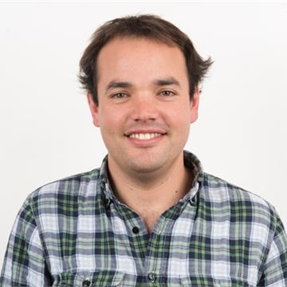
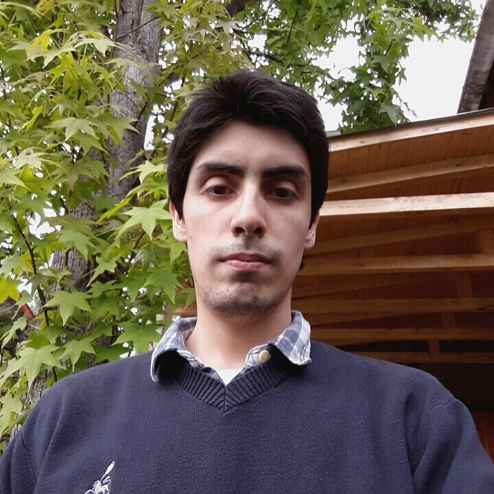
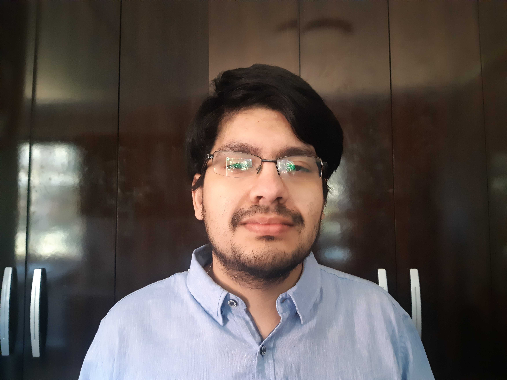
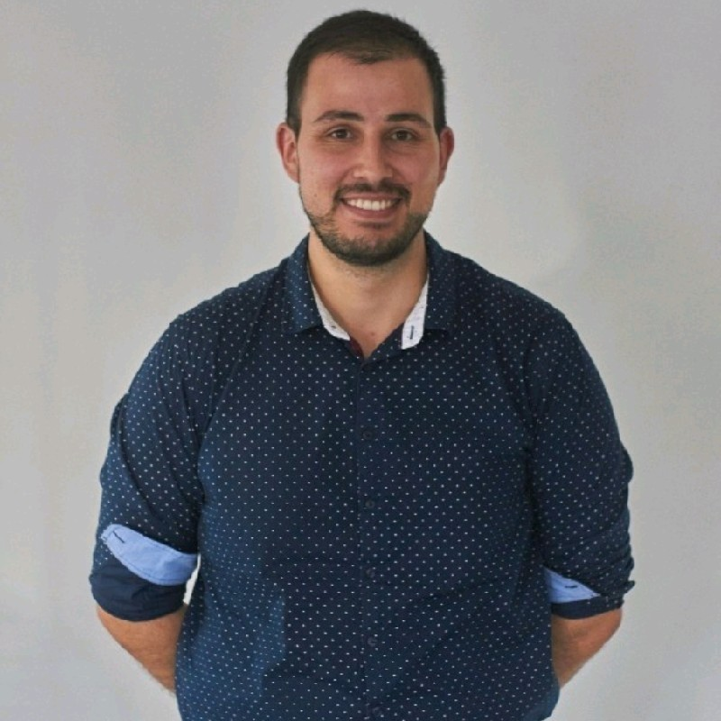

## Principal investigator

### Christopher D. Cooper
{:width="200px"}

<a href="http://github.com/cdcooper84"><i class="fa fa-fw fa-github" aria-hidden="true"></i> GitHub</a> <a href="https://www.linkedin.com/in/christopher-cooper-54594923" itemprop="sameAs"> <i class="fa fa-fw fa-linkedin-square" aria-hidden="true"></i> LinkedIn</a><a href="https://twitter.com/cooperchrisd" itemprop="sameAs"><i class="fa fa-fw fa-twitter-square" aria-hidden="true"></i> Twitter</a>  
BS, PEng (USM), MS, PhD (Boston University) Mechanical Engineering. <a href="../CV_cooper.pdf" style="color:#52adc8;">CV</a>.

## PhD students

### Sergio Urzúa
{:width="200px"}

<a href="http://github.com/bem4solvation"><i class="fa fa-fw fa-github" aria-hidden="true"></i> GitHub</a> <a href="https://www.linkedin.com/in/sergio-urzua-67160154" itemprop="sameAs"> <i class="fa fa-fw fa-linkedin-square" aria-hidden="true"></i> LinkedIn</a>  
BS, PEng, MS, Mechanical Engineering (USM).  
Topic: protein-surface interaction

### Mauricio Guerrero
{:width="200px"}

<a href="http://github.com/bem4solvation"><i class="fa fa-fw fa-github" aria-hidden="true"></i> GitHub</a> <a href="https://www.linkedin.com/" itemprop="sameAs"> <i class="fa fa-fw fa-linkedin-square" aria-hidden="true"></i> LinkedIn</a>  
BS, PEng, MS, Mechanical Engineering (USM).  
Topic: FEM-BEM coupling

## MS students

### Felipe Vicencio
{:width="200px"}

<a href="https://github.com/fvicencioh"><i class="fa fa-fw fa-github" aria-hidden="true"></i> GitHub</a> <a href="https://www.linkedin.com/in/felipe-vicencio-hidalgo-18aaa41b7/" itemprop="sameAs"> <i class="fa fa-fw fa-linkedin-square" aria-hidden="true"></i> LinkedIn</a>  
BS, PEng, Mechanical Engineering (USM)
Topic: polarizable force fields

## Undergraduate students

### Vicente Barrera

 
<a href="http://github.com/bem4solvation"><i class="fa fa-fw fa-github" aria-hidden="true"></i> GitHub</a> <a href="https://www.linkedin.com/" itemprop="sameAs"> <i class="fa fa-fw fa-linkedin-square" aria-hidden="true"></i> LinkedIn</a>  
Topic: PB calculations in electroflotation

### Christian Herrera

 
<a href="http://github.com/bem4solvation"><i class="fa fa-fw fa-github" aria-hidden="true"></i> GitHub</a> <a href="https://www.linkedin.com/in/christian-herrera-vergara-b42095335/" itemprop="sameAs"> <i class="fa fa-fw fa-linkedin-square" aria-hidden="true"></i> LinkedIn</a>  
Topic: Protein-surface interaction

### Ivan Ianiszewski

 
<a href="http://github.com/bem4solvation"><i class="fa fa-fw fa-github" aria-hidden="true"></i> GitHub</a> <a href="https://www.linkedin.com/in/ivan-ianiszewski-lay-1253362a0/" itemprop="sameAs"> <i class="fa fa-fw fa-linkedin-square" aria-hidden="true"></i> LinkedIn</a>  
Topic: dipolar PB

### Francisca Silva

 
<a href="http://github.com/bem4solvation"><i class="fa fa-fw fa-github" aria-hidden="true"></i> GitHub</a> <a href="https://www.linkedin.com/" itemprop="sameAs"> <i class="fa fa-fw fa-linkedin-square" aria-hidden="true"></i> LinkedIn</a>  
Topic: Protein-surface interaction for biosensors

### Joseline Villagrán 
(co-guided with Harvey Zambrano)

 
<a href="http://github.com/bem4solvation"><i class="fa fa-fw fa-github" aria-hidden="true"></i> GitHub</a> <a href="https://www.linkedin.com/in/joseline-villagran-9a0a692b3/" itemprop="sameAs"> <i class="fa fa-fw fa-linkedin-square" aria-hidden="true"></i> LinkedIn</a>  
Topic: interfacial solvent

### Gaspar Vuchetich

 
<a href="http://github.com/bem4solvation"><i class="fa fa-fw fa-github" aria-hidden="true"></i> GitHub</a> <a href="https://www.linkedin.com/in/ivan-ianiszewski-lay-1253362a0/" itemprop="sameAs"> <i class="fa fa-fw fa-linkedin-square" aria-hidden="true"></i> LinkedIn</a>  
Topic: dipolar PB

### Gonzalo Rojas

 
<a href="https://github.com/bem4solvation"><i class="fa fa-fw fa-github" aria-hidden="true"></i> GitHub</a> <a href="https://www.linkedin.com/in/gonzalo-rojas-oñate-031016221/" itemprop="sameAs"> <i class="fa fa-fw fa-linkedin-square" aria-hidden="true"></i> LinkedIn</a>  
Topic: ML for adaptive mesh refinement

## Past members
 * Eduardo Hasbún (MS). Topic: Convolutional neural networks to solve the Poisson equation
 * Nehemías Sandoval (BS, PEng). Topic: ML for adaptive mesh refinement
 * Willy Menacho (MS). Topic: electrostatics in viruses
 * Martín Achondo (MS). Topic: physics informed neural networks
 * Byron Vega (BS, PEng). Topic: linear/nonlinear PB
 * Camila Pérez (BS, PEng). Topic: linear/nonlinear PB
 * Manuel Ruiz (visiting PhD student). Topic: hydrogenase-surface interaction
 * Ian Addison-Smith (BS, PEng). Topic: electrostatic force
 * Ignacio Muñoz (BS, PEng). Topic: nonpolar solvation free energy
 * Elmo Begazo (BS, PEng). Topic: adaptive mesh refinement
 * Stefan Search (BS, Peng). Topic: PBJ software development, boundary integral formulations
 * Kenneth Styles (BS, PEng). Topic: SLIC, PBJ software development. 
 * Miguel Godoy (BS, PEng). Topic: uncertainty quantification, PBJ development. 
 * Matías Martínez (MS). Topic: virus-scale simulations, parallel computing
 * Javier Gómez (MS). Topic: Stokes flow in biological systems
 * Rodrigo Huencho (BS). Topic: dielectric constant parameterization
 * Valentina Oyarzún (BS, PEng). Topic: nonpolar solvation 
 * Joaquín Echaíz (BS, PEng). Topic: nonpolar solvation 
 * Vicente Ramm (BS, PEng). Topic: error estimation, adaptive mesh refinement
 * Nicolás Espinoza (BS, PEng). Topic: membrane proteins

## Collaborators
 * Lorena A. Barba (GWU, US)
 * Jaydeep P. Bardhan (PNNL, US)
 * Timo Betcke (UCL, UK)
 * Michal Bosy (Kingston, UK)
 * Jehanzeb H. Chaudhry (UNM, US)
 * Marcia Fenley (FSU, US)
 * Carlos D. García (Clemson, US)
 * Horacio V. Guzmán (UAM, Spain and JZI, Slovenia)
 * Jaime Pizarro (USACH, Chile)
 * Elwin van't Wout (PUC, Chile)

