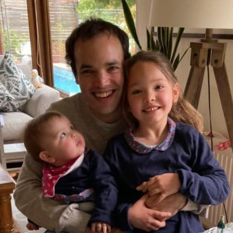

## Principal investigator

### Christopher D. Cooper
{:width="200px"}

<a href="http://github.com/cdcooper84"><i class="fa fa-fw fa-github" aria-hidden="true"></i> GitHub</a> <a href="https://www.linkedin.com/in/christopher-cooper-54594923" itemprop="sameAs"> <i class="fa fa-fw fa-linkedin-square" aria-hidden="true"></i> LinkedIn</a>  
BS, PEng (USM), MS, PhD (Boston University) Mechanical Engineering. <a href="../CV_cooper.pdf" style="color:#52adc8;">CV</a>.

## PhD student

### Sergio Urzúa
{:width="200px"}

<a href="http://github.com/bem4solvation"><i class="fa fa-fw fa-github" aria-hidden="true"></i> GitHub</a> <a href="https://www.linkedin.com/in/sergio-urzua-67160154" itemprop="sameAs"> <i class="fa fa-fw fa-linkedin-square" aria-hidden="true"></i> LinkedIn</a>  
BS, PEng, Mechanical Engineering (USM).  
Topic: protein-surface interaction

## MS students

### Mauricio Guerrero
{:width="200px"}

<a href="http://github.com/bem4solvation"><i class="fa fa-fw fa-github" aria-hidden="true"></i> GitHub</a> <a href="https://www.linkedin.com/" itemprop="sameAs"> <i class="fa fa-fw fa-linkedin-square" aria-hidden="true"></i> LinkedIn</a>  
BS, Mechanical Engineering (USM).  
Topic: FEM-BEM coupling

### Miguel Godoy

<a href="http://github.com/mgodoydiaz"><i class="fa fa-fw fa-github" aria-hidden="true"></i> GitHub</a> <a href="https://www.linkedin.com/miguel-godoy-díaz-811730130" itemprop="sameAs"> <i class="fa fa-fw fa-linkedin-square" aria-hidden="true"></i> LinkedIn</a>  
BS, PEng, Mechanical Engineering (USM).  
Topic: uncertainty quantification, PBJ development 

## Undergraduate students

### Kenneth Styles
{:width="200px"}

 
<a href="http://github.com/kstylesc"><i class="fa fa-fw fa-github" aria-hidden="true"></i> GitHub</a> <a href="https://www.linkedin.com/kennethstyles" itemprop="sameAs"> <i class="fa fa-fw fa-linkedin-square" aria-hidden="true"></i> LinkedIn</a>  
Topic: hydration asymmetry, PBJ development

### Camila Pérez
{:width="200px"}

 
<a href="http://github.com/bem4solvation"><i class="fa fa-fw fa-github" aria-hidden="true"></i> GitHub</a> <a href="https://www.linkedin.com/" itemprop="sameAs"> <i class="fa fa-fw fa-linkedin-square" aria-hidden="true"></i> LinkedIn</a>  
Topic: RNA-virus interaction 

### Stefan Search
{:width="200px"}

 
<a href="http://github.com/sdsearch"><i class="fa fa-fw fa-github" aria-hidden="true"></i> GitHub</a> <a href="https://www.linkedin.com/" itemprop="sameAs"> <i class="fa fa-fw fa-linkedin-square" aria-hidden="true"></i> LinkedIn</a>  
BS, PEng Mechanical Engineering (USM)  
Topic: boundary integral formulations, PBJ development 

### Elmo Begazo
{:width="200px"}

 
<a href="http://github.com/"><i class="fa fa-fw fa-github" aria-hidden="true"></i> GitHub</a> <a href="https://www.linkedin.com/" itemprop="sameAs"> <i class="fa fa-fw fa-linkedin-square" aria-hidden="true"></i> LinkedIn</a>  
Topic: surface meshes 

### Ignacio Muñoz
{:width="200px"}

 
<a href="http://github.com/"><i class="fa fa-fw fa-github" aria-hidden="true"></i> GitHub</a> <a href="https://www.linkedin.com/" itemprop="sameAs"> <i class="fa fa-fw fa-linkedin-square" aria-hidden="true"></i> LinkedIn</a>  
Co-adviced with José Antonio Gárate (UV)  
Topic: free energy calculations, nonpolar solvation

### Ian Addison-Smith

 
<a href="http://github.com/"><i class="fa fa-fw fa-github" aria-hidden="true"></i> GitHub</a> <a href="https://www.linkedin.com/" itemprop="sameAs"> <i class="fa fa-fw fa-linkedin-square" aria-hidden="true"></i> LinkedIn</a>  
Topic: force calculation

## Past members
 
 * Felipe Vicencio (BS, PEng). Topic: polarizable force fields.
 * Matías Martínez (MS). Topic: virus-scale simulations, parallel computing
 * Javier Gómez (MS). Topic: Stokes flow
 * Rodrigo Huencho (BS). Topic: dielectric constant parameterization
 * Valentina Oyarzún (BS, PEng). Topic: nonpolar solvation 
 * Joaquín Echaíz (BS, PEng). Topic: nonpolar solvation 
 * Vicente Ramm (BS, PEng). Topic: error estimation, adaptive mesh refinement
 * Nicolás Espinoza (BS, PEng). Topic: membrane proteins
  
