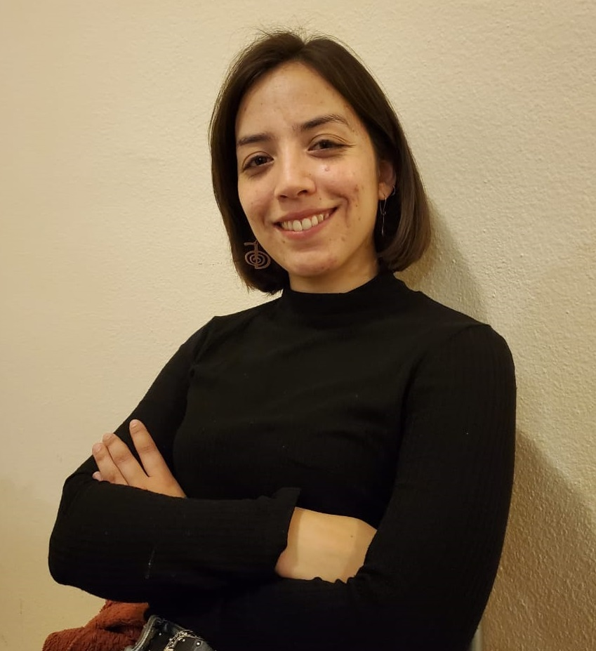
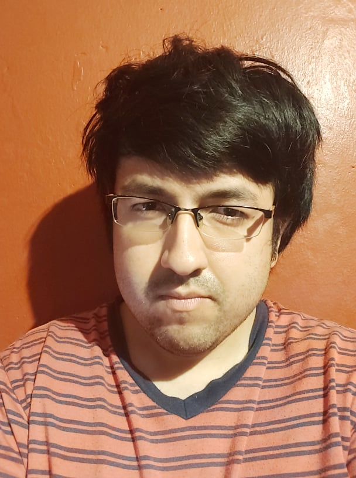
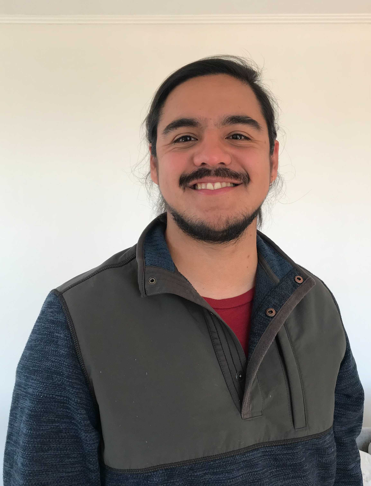

## PI

## PhD student

### Sergio Urzúa
{:width="200px"}

BS, PE, Mechanical Engineering (USM).  
Topic: protein-surface interaction

## MS students

### Mauricio Guerrero
{:width="200px"}

BS, Mechanical Engineering (USM).  
Topic: FEM-BEM coupling

### Miguel Godoy

BS, PE, Mechanical Engineering (USM).  
Topic: uncertainty quantification, PBJ development 

## Undergraduate students

### Kenneth Styles
{:width="200px"}

 Topic: hydration asymmetry, PBJ development

### Camila Pérez
{:width="200px"}

 Topic: RNA-virus interaction 

### Stefan Search
{:width="200px"}

 BS, PE Mechanical Engineering (USM)  
Topic: boundary integral formulations, PBJ development 

### Elmo Begazo
{:width="200px"}

 Topic: surface meshes 

### Ignacio Muñoz
{:width="200px"}

 Co-adviced with José Antonio Gárate (UV)
Topic: free energy calculations, nonpolar solvation

### Ian Addison-Smith

 Topic: force calculation

## Past members

 * Felipe Vicencio (BS, PE  Mechanical Engineering). Topic: polarizable force fields.
 * Matías Martínez (MS, Mechanical Engineering). Topic: virus-scale simulations, parallel computing
 * Javier Gómez (MS, Mechanical Engineering). Topic: Stokes flow
 * Rodrigo Huencho (BS Mechanical Engineering). Topic: dielectric constant parameterization
 * Valentina Oyarzún (BS, PE Mechanical Engineering). Topic: nonpolar solvation 
 * Joaquín Echaíz (BS, PE Mechanical Engineering). Topic: nonpolar solvation 
 * Vicente Ramm (BS, PE Mechanical Engineering). Topic: error estimation, adaptive mesh refinement
 * Nicolás Espinoza (BS, PE Mechanical Engineering). Topic: membrane proteins
  
