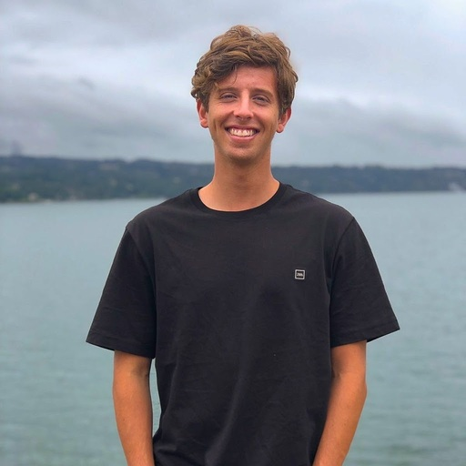
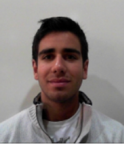
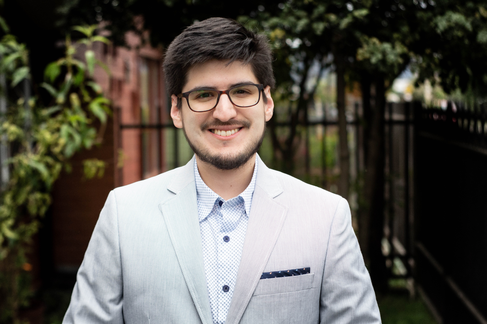

## Principal investigator

### Christopher D. Cooper
{:width="200px"}

<a href="http://github.com/cdcooper84"><i class="fa fa-fw fa-github" aria-hidden="true"></i> GitHub</a> <a href="https://www.linkedin.com/in/christopher-cooper-54594923" itemprop="sameAs"> <i class="fa fa-fw fa-linkedin-square" aria-hidden="true"></i> LinkedIn</a><a href="https://twitter.com/cooperchrisd" itemprop="sameAs"><i class="fa fa-fw fa-twitter-square" aria-hidden="true"></i> Twitter</a>  
BS, PEng (USM), MS, PhD (Boston University) Mechanical Engineering. <a href="../CV_cooper.pdf" style="color:#52adc8;">CV</a>.

## PhD students

### Sergio Urzúa
{:width="200px"}

<a href="http://github.com/bem4solvation"><i class="fa fa-fw fa-github" aria-hidden="true"></i> GitHub</a> <a href="https://www.linkedin.com/in/sergio-urzua-67160154" itemprop="sameAs"> <i class="fa fa-fw fa-linkedin-square" aria-hidden="true"></i> LinkedIn</a>  
BS, PEng, Mechanical Engineering (USM).  
Topic: protein-surface interaction

### Mauricio Guerrero
{:width="200px"}

<a href="http://github.com/bem4solvation"><i class="fa fa-fw fa-github" aria-hidden="true"></i> GitHub</a> <a href="https://www.linkedin.com/" itemprop="sameAs"> <i class="fa fa-fw fa-linkedin-square" aria-hidden="true"></i> LinkedIn</a>  
BS, Mechanical Engineering (USM).  
Topic: FEM-BEM coupling

## MS students

### Martín Achondo
{:width="200px"}

<a href="https://github.com/MartinAchondo"><i class="fa fa-fw fa-github" aria-hidden="true"></i> GitHub</a> <a href="https://www.linkedin.com/in/mart%C3%ADn-achondo-mercado-49aa00247" itemprop="sameAs"> <i class="fa fa-fw fa-linkedin-square" aria-hidden="true"></i> LinkedIn</a>  
BS, Mechanical Engineering (USM).  
Topic: physics-informed neural networks for the PB equation 

### Eduardo Hasbún
{:width="200px"}

<a href="https://github.com/EduardoHasbun"><i class="fa fa-fw fa-github" aria-hidden="true"></i> GitHub</a> <a href="https://www.linkedin.com/" itemprop="sameAs"> <i class="fa fa-fw fa-linkedin-square" aria-hidden="true"></i> LinkedIn</a>  
BS, Mechanical Engineering (USM).  
Topic: convolutional neural networks for the PB equation 

### Willy Menacho
{:width="200px"}

<a href="https://github.com/willymenacho"><i class="fa fa-fw fa-github" aria-hidden="true"></i> GitHub</a> <a href="https://www.linkedin.com/" itemprop="sameAs"> <i class="fa fa-fw fa-linkedin-square" aria-hidden="true"></i> LinkedIn</a>  
BS, Physics (, Bolivia).  
Topic: protein-RNA interaction 

### Miguel Godoy
{:width="200px"}

<a href="http://github.com/mgodoydiaz"><i class="fa fa-fw fa-github" aria-hidden="true"></i> GitHub</a> <a href="https://www.linkedin.com/in/miguel-godoy-d%C3%ADaz-811730130/" itemprop="sameAs"> <i class="fa fa-fw fa-linkedin-square" aria-hidden="true"></i> LinkedIn</a>  
BS, PEng, Mechanical Engineering (USM).  
Topic: uncertainty quantification, PBJ development 

## Undergraduate students

### Byron Vega
{:width="200px"}

 
<a href="https://github.com/ByronVegaL"><i class="fa fa-fw fa-github" aria-hidden="true"></i> GitHub</a> <a href="https://www.linkedin.com/in/byron-alexander-vega-lagos-309639169" itemprop="sameAs"> <i class="fa fa-fw fa-linkedin-square" aria-hidden="true"></i> LinkedIn</a>  
Topic: nonlinear PB

### Nehemías Sandoval

 
<a href="http://github.com/bem4solvation"><i class="fa fa-fw fa-github" aria-hidden="true"></i> GitHub</a> <a href="https://www.linkedin.com/" itemprop="sameAs"> <i class="fa fa-fw fa-linkedin-square" aria-hidden="true"></i> LinkedIn</a>  
Topic: ML for adaptive mesh refinement

## Past members
 * Camila Pérez (BS, PEng). Topic: linear/nonlinear PB
 * Manuel Ruiz (visiting PhD student). Topic: hydrogenase-surface interaction
 * Ian Addison-Smith (BS, PEng). Topic: electrostatic force
 * Ignacio Muñoz (BS, PEng). Topic: nonpolar solvation free energy
 * Elmo Begazo (BS, PEng). Topic: adaptive mesh refinement
 * Stefan Search (BS, Peng). Topic: PBJ software development, boundary integral formulations
 * Kenneth Styles (BS, PEng). Topic: SLIC, PBJ software development. 
 * Felipe Vicencio (BS, PEng). Topic: polarizable force fields.
 * Matías Martínez (MS). Topic: virus-scale simulations, parallel computing
 * Javier Gómez (MS). Topic: Stokes flow in biological systems
 * Rodrigo Huencho (BS). Topic: dielectric constant parameterization
 * Valentina Oyarzún (BS, PEng). Topic: nonpolar solvation 
 * Joaquín Echaíz (BS, PEng). Topic: nonpolar solvation 
 * Vicente Ramm (BS, PEng). Topic: error estimation, adaptive mesh refinement
 * Nicolás Espinoza (BS, PEng). Topic: membrane proteins

## Collaborators
 * Lorena A. Barba (GWU, US)
 * Jaydeep P. Bardhan (PNNL, US)
 * Timo Betcke (UCL, UK)
 * Michal Bosy (Kingston, UK)
 * Jehanzeb H. Chaudhry (UNM, US)
 * Marcia Fenley (FSU, US)
 * Carlos D. García (Clemson, US)
 * Horacio V. Guzmán (UAM, Spain and JZI, Slovenia)
 * Elwin van't Wout (PUC, Chile)

