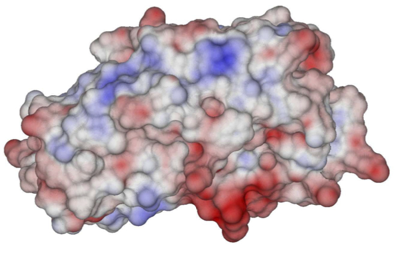
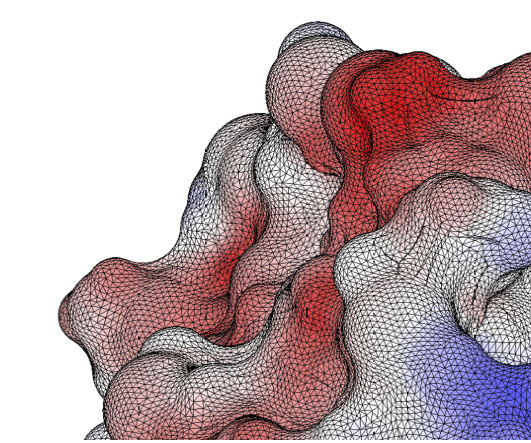
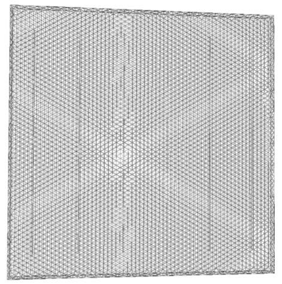
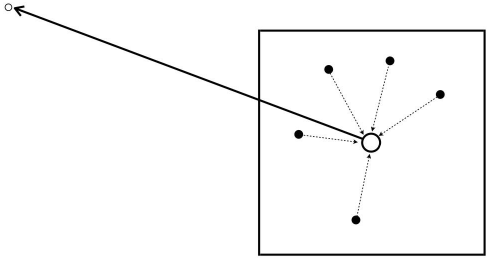

Our research is highly interdisciplinary, and touches a wide variety of topics: from biomolecular physics, to math, to computational science. Most of our work is related to the solution of the Poisson-Boltzmann equation using boundary integral methods.

This research has been funded by ANID, through their FONDECYT and FONDEF programs, and USM, by means of internal funding from the DGIIE (Office of Research, Innovation and Entrepreneurship). Their support is highly appreciated.

For an up-to-date list of publications, visit Christopher's [google scholar profile](https://scholar.google.com/citations?user=_sAB1sAAAAAJ&hl=en&oi=ao)

## Biomolecular physics

My main research line is in the development of computer codes to simulate protein solvation with continuum electrostatic models (ie. considering the solvent as a dielectric region).
This yields system of PDEs where the Poisson and Poisson-Boltzmann equations are coupled on the molecular surface, which we represent with boundary integral equations.
We solve this numerically using boundary element methods, accelerated with fast methods that run on GPUs.

I have mostly worked on a code called [PyGBe](https://github.com/barbagroup/pygbe), which we have used to study solvation, binding, and adsorption, among other things.

{:width="300px"}{:width="300px"}

Left: Electrostatic potential on the molecular surface of a HIV-1 protease-substrate complex. Right: BEM mesh for lysozyme.

## Electromagnetic scattering

Lately, I have become interested in modeling electromagnetic scattering with application to sensors --- more specifically, nanoscale biosensors and ferromagnetic microwire-based stress sensors in polymers.
I also use BEM for these simulations, through PyGBe and the neat library [BEM++](http://www.bempp.org/).

{:width="300px"}

Mesh of a polymer matrix with inclusions of ferromagnetic microwires.

## Fast algorithms

One of the main disadvantages of BEM is that it generates dense matrices, yielding a O(N^2) scaling in memory and computer time that limits its applicability.
Because of this, I'm very interested in developing algorithms that improve this scaling to O(NlogN) or even O(N). More specifically, I've mostly worked with the treecode algorithm, which accelerates N-body problems to O(NlogN) by approximating far-away interactions to centers of expansion.

{:width="350px"}

Sketch of the treecode far-field approximation. White dots are 'targets' and black dots 'sources' of mass.

## High performance computing

Many real-life applications are just too big to model on a single CPU, and we require parallel processing and modern hardware to tackle them in reasonable time. 
Most of my work has been based in the use of GPUs for numerical algorithms, and recently I've been exploring to extend those algorithms to use multiple CPUs and GPUs.
